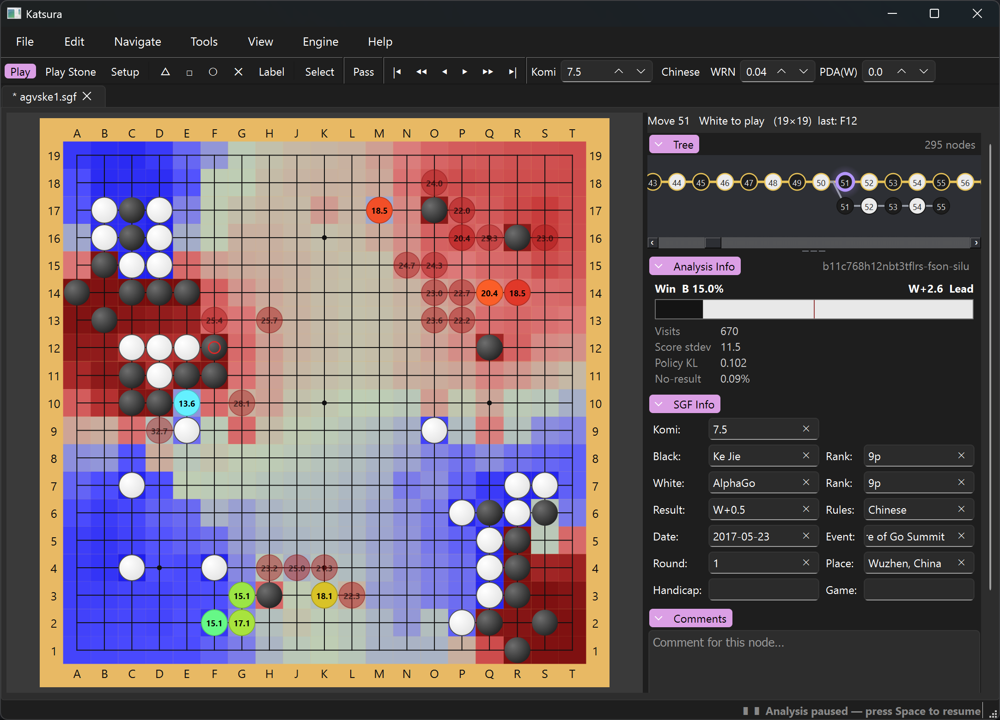

# Katsura



## About this App

This app was written almost entirely via Claude or other coding assistant tools, mostly because lightvector was looking for an SGF editor that:

* Supported live KataGo analysis.
* Displayed some of the more dev-oriented stats from KataGo analysis that aren't always displayed by GUIs.
* Tolerated nearly arbitrary SGF contents including illegal moves and edits, with a self-consistent data model for how to interpret such edits.
* Properly updated the live engine through arbitrary SGF moves and edits.
* Had good SGF editing capabilities that many editors don't have:
    * The ability to handle and play self-capturing moves, or moves violating the ko rule.
    * Support for rectangular boards.
    * The ability to cut and copy and paste subtrees of the SGF, or from one SGF to another SGF.
    * The ability to mirror and rotate the board.
    * The ability to select subsets of stones and click and drag them, copy and paste them to other nodes or other SGFs, or mirror and rotate them.
    * Editing tools that can handle things like adding stones that are already there, or redundant erasing of stones. (Relevant for advanced SGF editing if a subtree will be copy-pasted into another tree that suddenly makes such edits non-redundant.)
* Made it easy to build and extend the GUI (with the help of coding assistant tools) to add knobs and tools for arbitrary future experimental things:
    * Heatmaps and display of new experimental engine outputs or the ability to toggle engine search and debug options.
    * Diffusion-model-based inpainting of "plausible Go positions" (for composing game positions).
    * etc.

The code in this app has largely not been directly reviewed by human eyes, although substantial human iteration and feedback drove development (specification and design of the data model and various invariants to maintain and algorithmic approaches to use, testing and iteration on bugs and decisions on the features and ways things should behave, etc.).

This app may be updated intermittently and somewhat arbitrarily based on whatever lightvector wants to add for their own use. It's been posted here in case someone else finds it useful too. You can do what you want with it, see the License section below.

## Description

A graphical SGF editor for the game of Go (Baduk / Weiqi), written
in Python with a PySide6 (Qt) front end. Named for one of the woods a goban is
cut from.

The import package, the command and the executable are all lowercase `katsura`.

## Features (target)

- Graphical board with a graphical variation tree.
- Keyboard navigation through the variation tree (arrows, Page Up/Down = 10
  moves, Home/End, variation switching).
- Resizable panes (board / tree / comments) via splitters.
- Standard menus: open/save SGF, settings, tabs for multiple open files.
- Non-square boards, mid-board stone edits (AB/AW/AE), player-to-move (PL),
  comments, markers (circle/square/triangle/cross), and labels.
- Correct SGF escaping, tolerant parsing that preserves unknown properties on
  save, and compatibility handling (e.g. `tt` pass on boards <= 19).
- Rules tolerance: reads SGFs with self-capture / ko violations and still
  produces a valid position; forbids those by default on interactive play.

## Status

Standalone SGF editing and **live engine analysis** are both implemented:
tolerant round-trip SGF; non-square boards; alternating/fixed play; paint-drag
setup & markers; labels; a selection tool (cut/copy/move/paste with rotate/flip,
across files); a graphical variation tree (compact + dynamic-centered, unified
layout) with keyboard + wheel navigation; tabs; undo/redo; subtree
cut/copy/paste across files; komi field + collapsible Game Info panel; and
**GTP engine attachment for live analysis** — any engine that speaks GTP (e.g.
`katago gtp ...`, local or over `ssh`), with a board overlay of candidate moves
(weight-coloured, win-rate/score/visits + principal variation on hover), a
win-rate/visits read-out, a GTP console, and Spacebar to pause/resume.

See `docs/DESIGN.md` (architecture), `docs/MODEL.md` (editing semantics), and
`docs/ENGINE.md` (engine design).

## Development

```bash
# In a Python >=3.10 environment
pip install -e ".[dev]"      # editable install with pytest + ruff
python -m pytest             # run tests (headless; no display needed)
python -m katsura            # launch the GUI
# or, after install:
katsura
```

### Running on Linux / WSL

Qt offers two platform plugins here and neither is perfect under WSLg, so the
app picks one for you (`ui/app.py::_select_platform`):

| backend | rendering | menus |
|---------|-----------|-------|
| **xcb** (XWayland, the default) | soft — WSLg upscales a 1× framebuffer | fine |
| **wayland** | crisp, at the display's true scale | popups desync, so you can click the wrong item |

xcb is the default because a mis-clicked menu item is worse than soft text, and
the softness cannot be fixed from inside the app — the upscale happens after we
draw, so no amount of `QT_SCALE_FACTOR` helps. Override with
`QT_QPA_PLATFORM=wayland python -m katsura` if you prefer crispness. To get both
at once, either set the display to 100 % scaling in Windows and enlarge the UI
with `QT_SCALE_FACTOR=2`, or run the app under *Windows* Python, where Qt uses
the native platform plugin. In that last case engine commands still work: on
Windows `GtpEngine` routes them through `wsl.exe bash -lc` so ssh/bash commands
run Linux-side as usual (override with `KATSURA_ENGINE_SHELL`).

The test suite is POSIX-only — the mock GTP engine uses `select()` on stdin and
launches via `bash` — so run `pytest` on Linux/WSL rather than Windows Python.

## Standalone builds

`katsura.spec` (PyInstaller) produces self-contained one-folder bundles —
download, unzip, run; no Python required. `.github/workflows/release.yml`
builds Windows/Linux/macOS zips on a `v*` tag. See `docs/PACKAGING.md`.

## License

[BSD Zero Clause License](LICENSE) — use it for anything, commercially or not,
with no attribution required.
